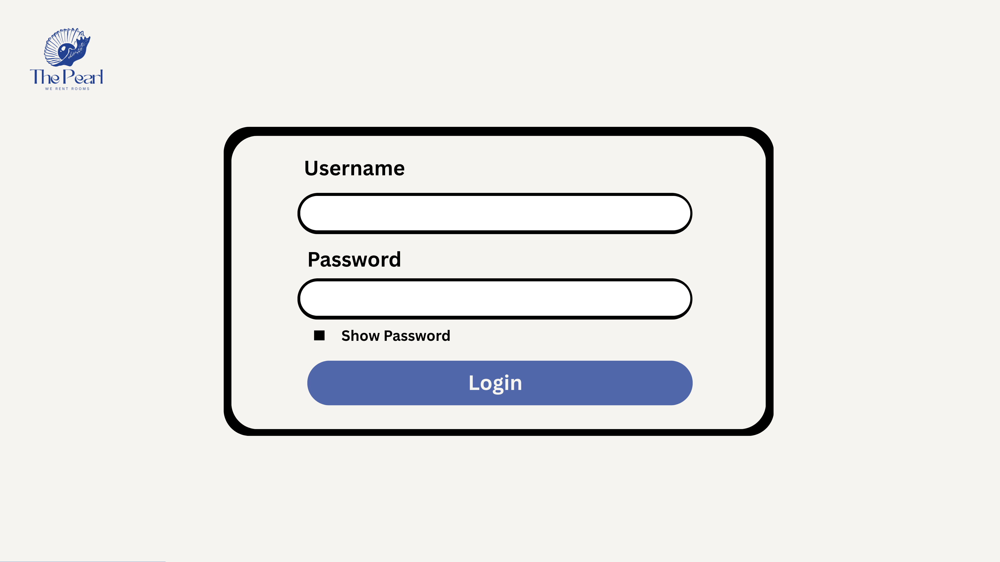
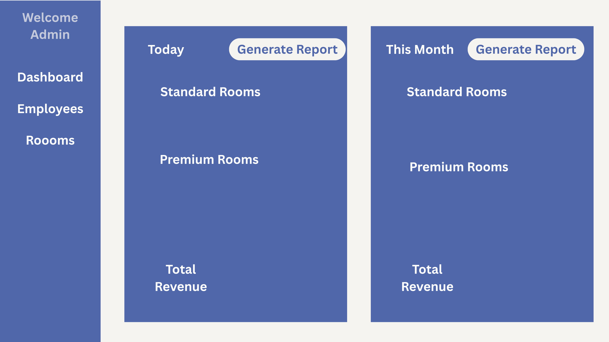
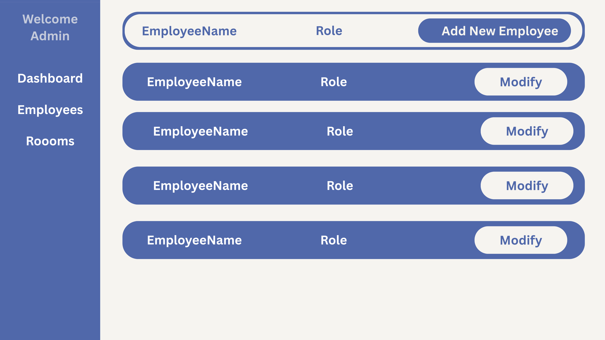
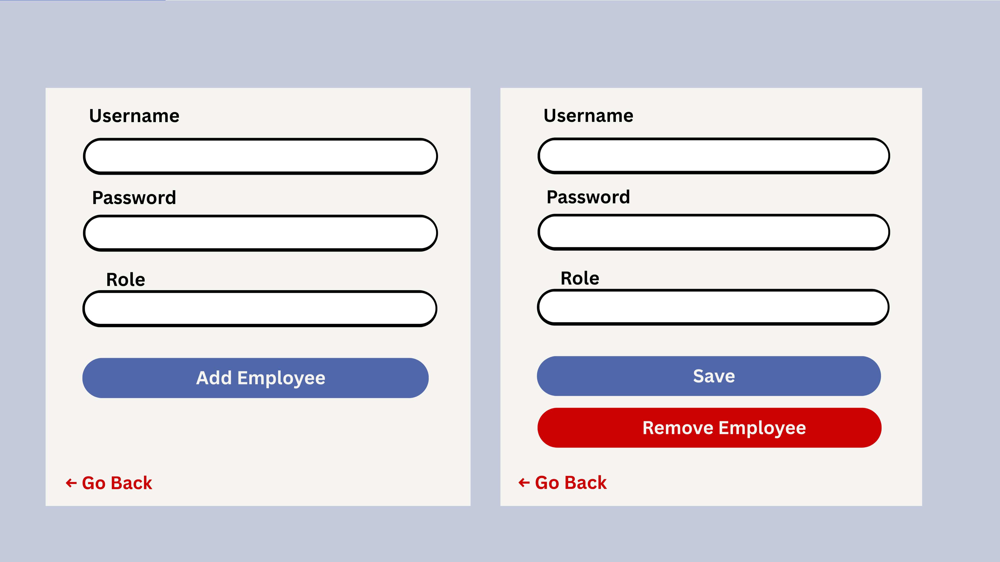
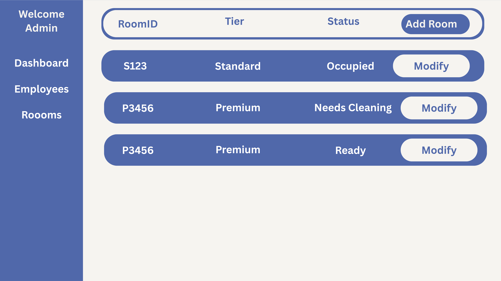
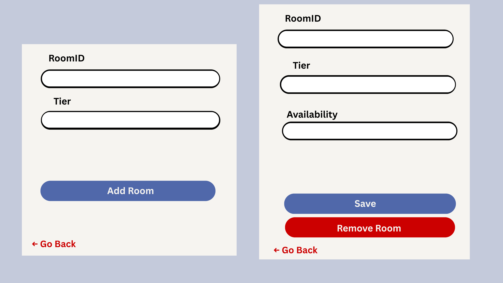
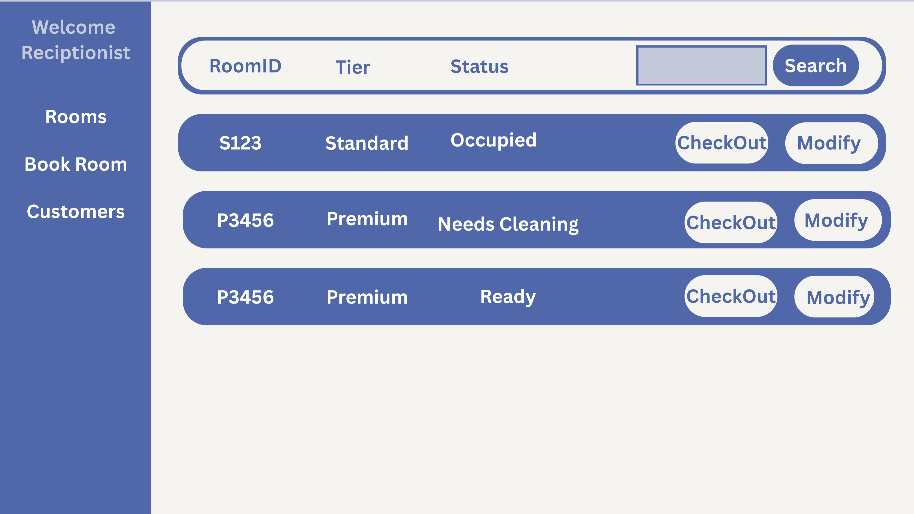
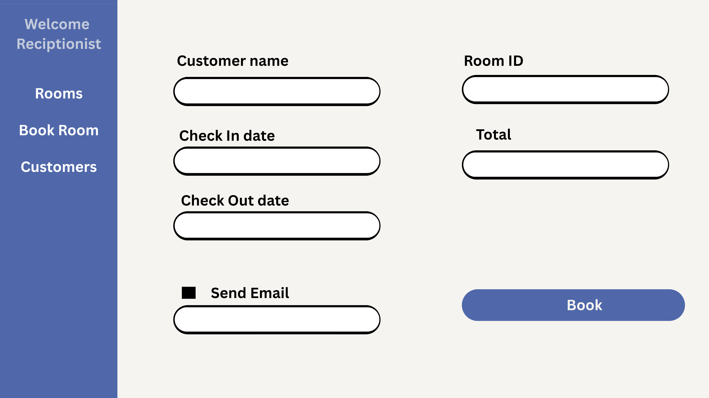
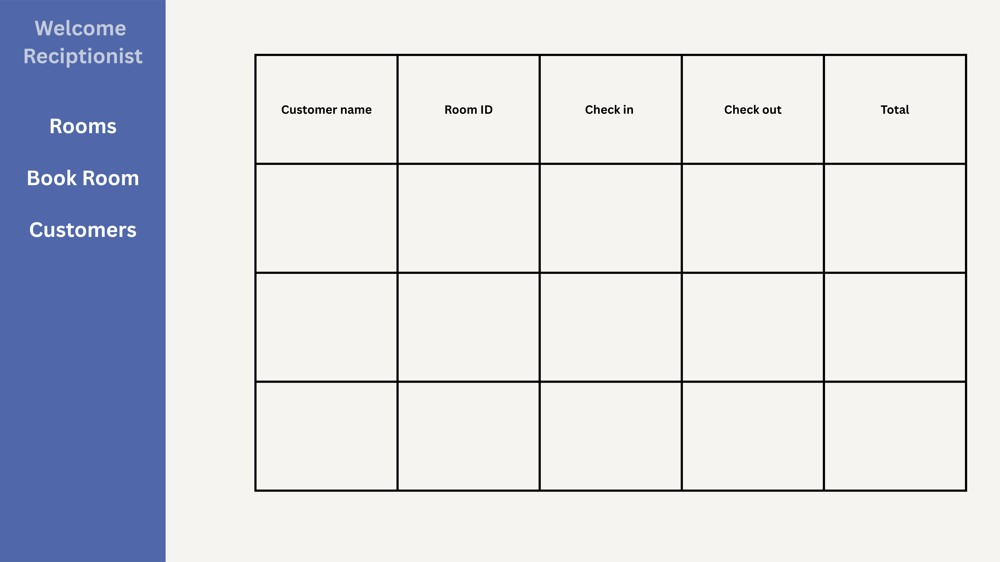

# Hotel Management System

## TO DO List
* ~~program functionality~~
* optional functionality
* ~~create UI Designs~~
* ~~Test and verify :~~ [Test 1](#Test_1)
* Fix found bugs
* Test Program

## Program Functionality
### Room management
* Types of rooms
    * Standard rooms
    * premium rooms

### Functionality
* Login
* LogOut
* Admin UI
    * Dashboard 
        * Consist of how many rooms were booked today and this month.
        * Consist of generate report from either statistics
    * Room Management
        * View All rooms
        * Add Modify Remove Rooms
        * Add rooms (Room ID, Tier)
    * Manage employees ( Add, remove, view, modify employees)
        * View all employees
        * Add Modify Remove Employees

* Receptionist UI
    * Book rooms for customers
    *  view all rooms (Change room status, (Occupied, Needs Cleaning, Ready))

### UI Design
#### Colors 
* Beige : #f6f4f0
* Blue : #234195
* Light blue : #5068aa
* Grey : #c4cadb
* RED : #cc0000
* Green : #79c139

### UI Mockups
#### LoginPage

#### AdminUI - Dashboard

#### AdminUI - Employees

#### AdminUI - Add/Modify Employees

#### AdminUI - Rooms

#### AdminUI - Add/Modify Rooms

#### ReceptionistUI - Rooms

#### ReceptionistUI - BookRooms

#### ReceptionistUI - Customers

## Test_1
Verify program functionality
### LoginPage
- successfully detect missing input
- successfully detect invalid credentials
- successfully logs in admin user to admin dashboard
- successfully logs in reception user to reception dashboard

### AminUI
- successfully displays admin dashboard
- ERROR : daily stats are not updating
- successfully displays real time monthly stats
####
- successfully switch to Employee tab
- successfully search employee
- successfully filter employee
- successfully takes to employee modifying form
- successfully modify employee role
- successfully modify employee password
- successfully asks remove employee verification
- successfully employee not removed when denied verification
- successfully remove employee
- successfully takes back to employee page
- ERROR : filter and search functionality not working when taken back to employee page
####
- successfully switch to room tab
- successfully search rooms
- successfully filter rooms
- successfully takes to room modifying form
- successfully modify room tier
- successfully modify room space
- successfully modify room status
- successfully modified room price
- successfully ask for room remove verification
- successfully remove room
####
- successfully takes to customerRecord tab
- successfully search records by customer
- successfully search records by records
- successfully search records by check in date
- successfully search records by check out date
  
#### ReceptionUI
- successfully takes to employee room tab
- successfully search room
- successfully filter room by tier
- successfully filter room by space
- successfully filter room by status
- successfully takes to room modifying form
- successfully modify room status
- successfully takes back to rooms tab
####
- successfully takes to book room tab
- successfully filter rooms by check in check out date
- successfully filter rooms by tier
- successfully filter rooms by space
- successfully takes to book room form
- successfully book room
- successfully takes back to book room tab
####
- successfully takes to customerRecord tab
- successfully search records by customer
- successfully search records by records
- successfully search records by check in date
- successfully search records by check out date